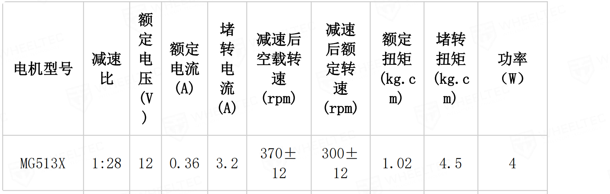
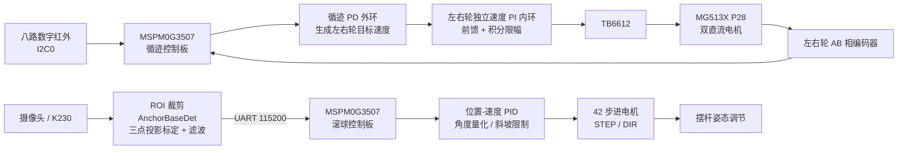

# 车载平衡滚球运动控制系统（2026 全国大学生电子设计竞赛 H 题）

本项目面向 2026 年全国大学生电子设计竞赛 H 题“车载平衡滚球运动控制系统”，实现一辆沿黑色环形轨迹运行、同时对摆杆内钢球进行视觉定位与姿态闭环控制的智能小车。

系统采用“车体循迹”和“滚球平衡”分工解耦的架构：一块 `MSPM0G3507` 负责红外循迹、编码器测速、双轮速度闭环和 A 点停车；另一块 `MSPM0G3507` 负责步进电机姿态调节；`K230` 运行轻量级视觉检测程序，将钢球相对中心点 `O` 的位置通过 UART 发送给滚球控制板。

> **项目状态**：仓库包含当前工程代码、PCB 工程、题目原文和技术报告。下文测试数据来自技术报告中的阶段性实测记录；第 4～6 问的最终成绩仍应以最终机械结构、赛道和裁判测量结果为准。



*图：项目使用的 MG513X P28 编码器电机资料示意。*

## 目录

- [系统架构](#系统架构)
- [功能与赛题任务](#功能与赛题任务)
- [控制算法](#控制算法)
- [硬件接口](#硬件接口)
- [仓库结构](#仓库结构)
- [编译与下载](#编译与下载)
- [上电操作](#上电操作)
- [通信协议](#通信协议)
- [阶段性测试结果](#阶段性测试结果)
- [已知限制与后续工作](#已知限制与后续工作)
- [相关资料](#相关资料)

## 系统架构



两条控制链路在软件上相互独立：车体循迹不依赖 K230 的视觉数据，K230 只向滚球控制板提供钢球位置。这样可以降低视觉推理对车辆实时控制的影响，也便于分板调试和后续整车联调。

## 功能与赛题任务

### 车体控制板：`code/2026-game/`

| 工程任务 | 对应赛题 | 当前实现 |
| --- | --- | --- |
| 任务 1 | 工程调试项，不对应正式问号 | 八路红外、编码器、轮速和 OLED 诊断；旧的 1500 mm 直行测距逻辑仍保留在代码中 |
| 任务 2 | 第 2 问 | 从 A 点出发循迹一圈，识别 A 点横线并停车、显示时间和里程 |
| 任务 3 | 第 4 问的车辆部分 | A→B 标称 1.5 m 循迹、计时、减速和停车 |
| 任务 4 | 第 5、6 问的车辆部分 | 整圈循迹，重新识别 A 点后低速滑停 |
| 任务 5 | 实验/扩展逻辑 | 基于 IMU 航向和红外的拐角转向，未作为本文主流程 |

### 滚球控制板：`code/stepMotor-code/Motor/`

| 工程任务 | 功能 |
| --- | --- |
| 任务 1 | 手动步进电机角度和方向调试 |
| 任务 2 | 钢球由 `O → +5 cm → -5 cm` 的静态往返控制 |
| 任务 3 | 钢球向 `O` 点闭环调节并在中心附近保持 |

滚球控制板的任务编号与车体控制板独立，不能直接与赛题问号混用。完整整车成绩需要将两块控制板、K230 和最终机械结构一起联调。

## 控制算法

### 1. 八路红外循迹与双轮闭环

- 将 8 路黑线状态标准化为 `b_i`，从左到右使用权重 `[-7, -5, -3, -1, 1, 3, 5, 7]`。
- 横向偏差：

  ```text
  e = Σ(w_i · b_i) / Σb_i
  ```

- 循迹外环使用 PD 控制（当前代码初始参数 `Kp=26`、`Kd=8`），输出左右轮差速目标，并对差速进行限幅。
- 每个车轮使用独立的速度 PI 内环，叠加静摩擦前馈和速度前馈，减小电机个体差异、电池电压和弯道负载变化的影响。
- 当没有检测到有效黑线时保留上一有效偏差并启动丢线计时；持续丢线或任务超时后进入安全停车。
- A 点横线需要满足里程布防、已经驶离起点、至少 4 路传感器同时检测到黑线并连续确认等条件，降低弯道和起步误判概率。

### 2. 编码器测速与里程

MG513X P28 为 13 线霍尔编码器、减速比 `1:28`，AB 相双边沿四倍频：

```text
每圈计数 = 13 × 28 × 4 = 1456 count/rev
理论距离系数 ≈ π × 65 / 1456 = 0.140 mm/count
代码实车标定后 ≈ 0.156 mm/count
```

速度每 20 ms 更新一次，并进行一阶低通滤波。代码中的 `1.111` 是当前轮胎、载荷和赛道条件下得到的经验标定系数，换用机械结构或轮胎后应重新标定。

### 3. K230 钢球视觉定位

- 输入图像为 `640×360`，只处理摆杆所在 ROI：`(x=15, y=161, w=612, h=32)`。
- KPU 使用 `AnchorBaseDet` 模型，当前类别为“小钢球”，模型输入 `320×320`，置信度阈值 `0.1`，NMS 阈值 `0.5`。
- 候选框先按类别筛选，再检查框中心到摆杆标定线的距离是否不超过 30 像素，最后选择置信度最高的目标。
- 使用 `-5 cm`、`O`、`+5 cm` 三个标定点进行一维投影，将二维检测结果转换为沿摆杆方向的位置；触摸屏点击可重新设置 `O` 点。
- 位置采用低通滤波，当前实现约为 `0.65 × 上一次结果 + 0.35 × 当前结果`。
- 未检测到钢球时同样发送 `FOUND=0`，使下位机能够执行视觉失效保护，而不是无限期使用旧坐标。

### 4. 步进电机与滚球平衡

- 步进驱动器每圈 `6400` 个 STEP 脉冲，单微步约 `0.05625°`，固定轴速度约 `60°/s`。
- 控制器根据钢球位置误差和位置变化速度计算摆杆相对倾角，执行位置—速度 PID。
- 输出经过角度限幅、量化和斜坡限制，降低倾角突变对钢球的冲击。
- 任务 2 使用约 50 ms 的视觉控制周期；任务 3 当前源码由 10 ms 应用节拍和 9 tick 配置得到约 90 ms 周期。
- 包含条件积分、静摩擦突破补偿、低速最小驱动和逻辑零位。逻辑零位表示启动时的相对姿态参考，不等同于机械绝对水平角。

## 硬件接口

### 车体循迹板（`2026-game`）

| 模块 | 接口/引脚 | 说明 |
| --- | --- | --- |
| 八路红外 | I2C0：SDA `PA28`，SCL `PA31` | 100 kHz，从机地址 `0x09` |
| OLED | I2C1：SDA `PB3`，SCL `PB2` | 常用地址 `0x3C` |
| TB6612 | 左轮方向 `PA8/PA9`，PWMA `PA12` | `STBY=PB24` |
| TB6612 | 右轮方向 `PA7/PB18`，PWMB `PA13` | 双路直流电机驱动 |
| 左轮编码器 | AB：`PA21/PA22` | 双边沿正交解码 |
| 右轮编码器 | AB：`PB19/PB20` | 双边沿正交解码 |
| 调试串口 | UART0：TX `PA10`，RX `PA11` | 115200 bit/s |
| IMU601 | UART3：RX `PA25`，TX `PA26` | 当前主任务默认不启用 |
| 按键 | 当前 `empty.syscfg`：KEY1 `PB8`、KEY2 `PB7` | 下拉输入，按下为高电平 |

> `code/2026-game/模块引脚定义.md` 中的按键表仍有 `PB6/PB7` 记录，与当前 `empty.syscfg` 不一致。实际制作和接线时请以本次使用的 SysConfig 生成结果和 PCB 为准，并先做通断核对。

### 滚球步进控制板（`stepMotor-code/Motor`）

| 模块 | 接口/引脚 | 说明 |
| --- | --- | --- |
| STEP | TIMG0 CCP0：`PA12` | 6400 脉冲/圈 |
| DIR | `PA13` | 控制步进方向 |
| 驱动控制 | DCY/SLP/RST：`PA14/PA15/PA16` | 电流衰减、休眠和复位 |
| K230 UART | UART0：RX `PA1`，TX `PA0` | 115200 bit/s |
| OLED | I2C1：SDA `PB3`，SCL `PB2` | 局部刷新显示 |
| 按键 | TASK/IS_START/MOTOR_START：`PB20/PB19/PB18` | 切换任务、启停和手动调试 |
| 应用节拍 | TIMG8 | 10 ms 中断，仅累计节拍，控制在主循环执行 |

接线时必须保证各模块共地；电机电源与 MCU 逻辑电源可分开供电，但不能把电机电源接到 MCU 的 3.3 V 输出。UART 按“模块 TX → MCU RX、模块 RX → MCU TX”交叉连接。

## 仓库结构

```text
.
├── code/
│   ├── 2026-game/                    # 车体循迹 CCS 工程
│   │   ├── main.c
│   │   ├── empty.syscfg              # SysConfig 配置源
│   │   ├── 模块引脚定义.md
│   │   └── user_driver/              # 电机、编码器、红外、OLED、按键等驱动
│   ├── stepMotor-code/Motor/          # 步进/滚球控制 CCS 工程
│   │   ├── empty.c                   # 主循环、任务状态机和控制逻辑
│   │   ├── control_config.h           # 集中式实机调参参数
│   │   ├── motor.c / motor.h          # STEP/DIR 脉冲与角度控制
│   │   ├── K230.c / K230.H            # UART 环形缓冲和协议解析
│   │   └── empty.syscfg
│   └── vision-code/
│       └── det_video_1_2_2_3.py       # K230 MicroPython 视觉程序
├── PCB板/                             # PCB 工程文件（EPro）
├── 模块相关资料/                      # TB6612、舵机等模块资料
├── 技术报告/371021001_s.pdf            # 项目技术报告
├── H题_车载平衡滚球运动控制系统.pdf      # 赛题原文
└── README.md
```

## 编译与下载

仓库提供的是 CCS/SysConfig 工程，没有提交 `ti_msp_dl_config.*`、`.out`、`.hex` 等生成文件，也没有 Makefile/CMake 构建脚本。

1. 安装 Code Composer Studio、对应版本的 MSPM0 SDK 和 SysConfig。
2. 在 CCS 中选择 **Import Existing CCS Project**，分别导入：
   - `code/2026-game/`
   - `code/stepMotor-code/Motor/`
3. 检查目标器件为 `MSPM0G3507`、封装为 `LQFP-64`，打开 `empty.syscfg` 并生成配置文件。
4. 连接 XDS/SWD 调试器，执行 Build、下载和运行。
5. K230 端需要额外部署 `code/vision-code/det_video_1_2_2_3.py`、目标检测 `.kmodel` 和 `deploy_config.json`。脚本默认从 `/sdcard/mp_deployment_source/` 读取部署文件；模型文件和配置文件当前未包含在仓库中。

两个 CCS 工程的 SysConfig/SDK 小版本可能不同，导入时应以各自 `empty.syscfg` 顶部声明和工程配置为准。

## 上电操作

### 车体控制板

1. 上电后 OLED 显示当前工程任务和传感器状态。
2. 按键 1 在未启动时切换任务，按键 2 执行任务复位或启动。
3. 任务 2～4 启动后，车辆自动循迹、测速、计时，并在对应的横线/里程条件满足后减速停车。

### 滚球控制板

1. 长按 TASK 键切换任务 1～3。
2. 任务 1 使用 MOTOR_START 键进行步进电机手动角度调试。
3. 任务 2、3 使用 IS_START 键启动或停止视觉闭环。
4. OLED 显示任务号、钢球位置、步进角度和视觉状态；持续 3 s 未收到有效视觉位置时停止 STEP 输出。

## 通信协议

K230 与滚球控制板之间使用 8 字节二进制帧，位置单位为 `0.1 cm`：

```text
AA 55 FOUND POS_L POS_H 00 00 CHECKSUM
```

| 字节 | 字段 | 含义 |
| --- | --- | --- |
| 0～1 | `AA 55` | 固定帧头 |
| 2 | `FOUND` | `1`：检测到钢球；`0`：当前帧无有效目标 |
| 3～4 | `POS_L POS_H` | 小端有符号 `int16`，相对 `O` 点的位置，单位 `0.1 cm` |
| 5～6 | `00 00` | 预留字节 |
| 7 | `CHECKSUM` | 字节 2～6 的低 8 位累加和（预留字节为 0 时等价于 `FOUND+POS_L+POS_H`） |

示例：`0` 表示 `O` 点，`+50` 表示 `+5.0 cm`，`-50` 表示 `-5.0 cm`。接收中断只负责写入环形缓冲区，协议解析在主循环中分批完成，避免串口处理阻塞控制任务。

## 阶段性测试结果

以下数据摘自 [技术报告](技术报告/371021001_s.pdf) 第四章，报告表格多数项目记录了 2 次测试。结果可用于展示当前方案性能，但不等同于最终裁判成绩。

| 测试项目 | 报告记录 | 赛题/设计目标 | 报告判定 |
| --- | --- | --- | --- |
| 图传显示与回放 | 连续 60 s、120 s；画面稳定、录像完整、可正常回放 | 满足实时显示和记录要求 | 合格 |
| 单圈循迹停车 | 15.56～15.80 s；停车偏差 1.0～1.2 cm | ≤20 s；≤2 cm | 合格 |
| 静态滚球往返 | 4.8～4.9 s；`+5 cm` 误差 0.6～0.7 cm，`-5 cm` 误差 0.6～0.7 cm | ≤5 s；端点误差 ≤1 cm | 合格 |
| A→B 动态平衡 | 6.45～6.50 s；钢球最大误差 0.7～0.8 cm | ≤8 s；误差 ≤1 cm | 合格 |
| 中心点整圈平衡 | 23.51 s；钢球最大误差 0.7～0.8 cm | ≤30 s；误差 ≤1 cm | 合格 |
| 任意位置整圈平衡 | 目标 `-5 cm` 或 `+3 cm`；23.51～23.52 s；误差 0.7～0.8 cm | ≤30 s；误差 ≤1 cm | 合格 |

## 已知限制与后续工作

- 第 4～6 问的完整成绩受最终车体、摆杆、轮胎、供电和赛道影响，需要完成整车重复性测试后再填写最终成绩。
- 当前测试方案计划每项重复 3 次，但报告表格多数只列出 2 次，建议补充更多样本、均值、最大值和标准差。
- 编码器距离系数 `1.111` 为经验标定值；轮胎直径、负载或地面变化后应重新标定。
- 需要复核八路红外的有效电平、位序和安装高度，并确认 `empty.syscfg` 与 PCB 的按键引脚一致。
- 当前步进控制没有直接的堵转/机械卡滞检测，实际装配应设置机械限位，并在后续版本增加故障检测。
- K230 模型、部署配置和完整图传/接收工程不在本仓库中，首次部署前需要自行准备并验证。
- `2026-game` 和 `stepMotor-code/Motor` 是两套独立 CCS 工程，当前 README 不把它们包装成一个可一键构建的工程。

## 相关资料

- [赛题原文](H题_车载平衡滚球运动控制系统.pdf)
- [技术报告](技术报告/371021001_s.pdf)
- [车体循迹 CCS 工程](code/2026-game/)
- [步进/滚球 CCS 工程](code/stepMotor-code/Motor/)
- [K230 视觉脚本](code/vision-code/det_video_1_2_2_3.py)
- [车体模块引脚定义](code/2026-game/模块引脚定义.md)
- [PCB 工程](PCB板/)
- [模块相关资料](模块相关资料/)

> 仓库当前未声明开源许可证；如需公开复用或二次发布，请在上传前补充许可证和队伍信息。
