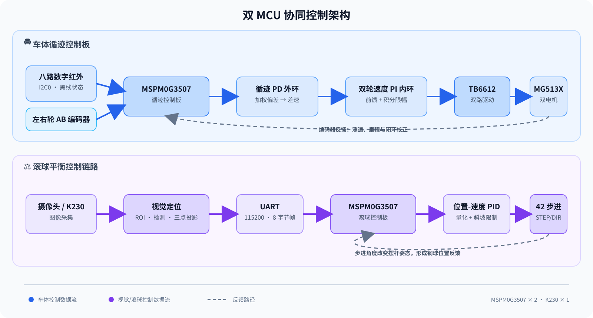

<div align="center">

# 🚗 车载平衡滚球运动控制系统

### 2026 全国大学生电子设计竞赛 · H 题

<p>
  <a href="#-项目概览"></a>
  <a href="#-系统架构"></a>
  <a href="#-控制策略"></a>
  <a href="#-仓库结构"></a>
  <a href="#-阶段性实测"></a>
</p>

<p>
  双 MCU 协同 · 八路红外循迹 · K230 钢球视觉定位 · 步进电机姿态闭环
</p>

<p>
  <a href="技术报告/371021001_s.pdf">📄 技术报告</a> ·
  <a href="H题_车载平衡滚球运动控制系统.pdf">📋 赛题原文</a> ·
  <a href="#-快速开始">🛠️ 快速开始</a> ·
  <a href="#-阶段性实测">📊 测试数据</a>
</p>

</div>

> 面向 2026 年全国大学生电子设计竞赛 H 题，完成一辆沿黑色环形轨迹运行、同时对摆杆内钢球进行视觉定位和姿态调节的智能小车。本文档以仓库当前代码和技术报告为准。

## ✨ 项目概览

系统将实时任务拆分到两块 `MSPM0G3507` 控制板：

| 子系统 | 主要职责 | 核心器件 | 工程位置 |
| --- | --- | --- | --- |
| 🚘 车体循迹 | 黑线识别、双轮驱动、编码器测速、里程/计时、A 点停车 | MSPM0G3507、八路红外、MG513X P28、TB6612 | [`code/2026-game/`](code/2026-game/) |
| 👁️ 视觉定位 | 检测钢球并换算为沿摆杆方向的一维位置 | K230、AnchorBaseDet/KPU、摄像头 | [`code/vision-code/`](code/vision-code/) |
| ⚖️ 滚球平衡 | 根据钢球位置闭环调节摆杆倾角 | MSPM0G3507、42 步进电机、STEP/DIR 驱动 | [`code/stepMotor-code/Motor/`](code/stepMotor-code/Motor/) |

车体循迹与滚球平衡相互解耦：车辆侧不依赖 K230 才能运行，K230 只向滚球控制板发送钢球位置，从而减少视觉推理对车辆实时控制的影响。

### 设计亮点

- **双环循迹控制**：八路红外加权偏差 + PD 外环，左右轮独立速度 PI 内环。
- **视觉一维标定**：将钢球检测框中心投影到摆杆标定线，降低二维抖动对控制的影响。
- **可靠通信**：UART 接收中断只写环形缓冲区，协议解析在主循环中限量执行，带帧头和校验和。
- **平滑执行**：步进角度量化、斜坡限制、静摩擦突破补偿和条件积分共同抑制冲击与低速卡滞。
- **故障保护**：循迹丢线/超时、视觉持续丢失、UART 校验失败等情况均有明确的安全处理路径。

### 📈 阶段性数据快照

<table align="center">
  <tr>
    <td align="center">🚘<br><strong>15.56–15.80 s</strong><br><sub>单圈循迹</sub></td>
    <td align="center">⚖️<br><strong>4.8–4.9 s</strong><br><sub>静态滚球往返</sub></td>
    <td align="center">🛣️<br><strong>6.45–6.50 s</strong><br><sub>A→B 动态平衡</sub></td>
    <td align="center">🎯<br><strong>0.7–0.8 cm</strong><br><sub>整圈最大位置误差</sub></td>
  </tr>
</table>

<p align="center"><sub>数据摘自技术报告中的阶段性测试记录，详细条件和限制见<a href="#-阶段性实测">阶段性实测</a>。</sub></p>

## 🧭 系统架构

<p align="center">
  
</p>

> 架构图使用仓库内静态 SVG，不依赖 Mermaid 渲染；车体和滚球两条控制链路相互独立，UART 只传递钢球一维位置。

| 控制链路 | 数据流 |
| --- | --- |
| 🚘 车体循迹 | 八路红外 → 加权偏差/PD → 左右轮目标速度 → 编码器 PI → TB6612 → 双直流电机 |
| ⚖️ 滚球平衡 | 摄像头/K230 → ROI 与一维标定 → UART → 位置-速度 PID → STEP/DIR → 摆杆姿态 |

## 🎯 赛题任务与软件任务

### 车体控制板：`code/2026-game/`

| 软件任务 | 赛题对应 | 当前功能 |
| --- | --- | --- |
| 任务 1 | 工程调试项，不对应正式问号 | 八路红外、编码器、轮速和 OLED 诊断；旧的 1500 mm 直行测距逻辑保留在代码中 |
| 任务 2 | 第 2 问 | 从 A 点出发循迹一圈，识别 A 点横线并停车，显示时间与里程 |
| 任务 3 | 第 4 问车辆部分 | A→B 标称 1.5 m 循迹、计时、减速和停车 |
| 任务 4 | 第 5、6 问车辆部分 | 整圈循迹，重新识别 A 点后低速滑停 |
| 任务 5 | 实验/扩展逻辑 | IMU 航向辅助的拐角转向和找线流程，未作为本文主流程 |

### 滚球控制板：`code/stepMotor-code/Motor/`

| 软件任务 | 当前功能 |
| --- | --- |
| 任务 1 | 手动步进电机方向与角度调试 |
| 任务 2 | 钢球 `O → +5 cm → -5 cm` 静态往返控制 |
| 任务 3 | 钢球向 `O` 点闭环调节，并在中心附近保持 |

> 两块控制板的任务编号彼此独立。滚球工程的“任务 2/3”不能直接等同于车体工程或赛题中的问号编号。

## 🎛️ 控制策略

### 1. 八路红外循迹

从左到右的传感器权重为 `[-7, -5, -3, -1, 1, 3, 5, 7]`。将检测到黑线的通道记为 `b_i` 后，横向偏差为：

```text
e = Σ(w_i · b_i) / Σb_i
```

- 外环采用 PD 控制，当前初始参数为 `Kp=26`、`Kd=8`。
- PD 输出作为左右轮目标速度差，并进行限幅。
- 当 `N=Σb_i=0` 时保留上一有效偏差并启动丢线计时；超过阈值后安全停车。
- A 点横线需要满足“驶离起点 + 里程布防 + 多路同时检测 + 连续确认”等条件，避免起步或弯道误判。

### 2. 编码器测速与里程

MG513X P28 为 13 线霍尔编码器、减速比 `1:28`，AB 相双边沿四倍频：

```text
每圈计数 = 13 × 28 × 4 = 1456 count/rev
理论距离系数 ≈ π × 65 / 1456 = 0.140 mm/count
代码实车标定后 ≈ 0.156 mm/count
```

速度每 20 ms 更新一次并做一阶低通滤波。代码中的 `1.111` 是当前轮胎、载荷和赛道条件下的经验标定系数，更换机械结构后需要重新标定。

### 3. 左右轮速度 PI 内环

每个车轮独立计算速度误差，使用静摩擦前馈、速度前馈和 PI 校正：

```text
PWM = PWM_static + Kff · v_ref + Kp · (v_ref - v_actual) + Ki · ∫e dt
```

积分项具有限幅和抗饱和处理；目标速度接近零时清除积分并关闭静摩擦前馈，减少停车后爬行。

### 4. K230 钢球视觉定位

- 采集图像为 `640×360`，摆杆 ROI 为 `(x=15, y=161, w=612, h=32)`。
- 使用 `AnchorBaseDet` 模型检测“小钢球”，模型输入 `320×320`，置信度阈值 `0.1`，NMS 阈值 `0.5`。
- 候选框需满足类别正确且中心距标定线不超过 30 像素，最终取置信度最高者。
- 使用 `-5 cm`、`O`、`+5 cm` 三点像素坐标进行一维投影标定；触摸屏点击可重新设置 `O` 点。
- 位置经过低通滤波，当前实现约为 `0.65 × 上一次结果 + 0.35 × 当前结果`。

### 5. 步进电机与滚球 PID

- 步进驱动器每圈 `6400` 个 STEP 脉冲，单微步约 `0.05625°`，固定轴速度约 `60°/s`。
- 根据钢球位置误差和位置变化速度生成摆杆相对倾角命令。
- 输出经过角度限幅、量化和斜坡限制，并配合条件积分、静摩擦突破补偿和低速最小驱动。
- 任务 2 控制周期约 50 ms；任务 3 当前配置约 90 ms。
- 视觉连续 3 s 无有效位置时停止 STEP 输出并进入视觉丢失状态。

## 🔌 硬件接口

<details>
<summary>展开车体循迹板接口</summary>

| 模块 | 接口/引脚 | 说明 |
| --- | --- | --- |
| 八路红外 | I2C0：SDA `PA28`，SCL `PA31` | 100 kHz，从机地址 `0x09` |
| OLED | I2C1：SDA `PB3`，SCL `PB2` | 常用地址 `0x3C` |
| TB6612 左轮 | 方向 `PA8/PA9`，PWMA `PA12` | `STBY=PB24` |
| TB6612 右轮 | 方向 `PA7/PB18`，PWMB `PA13` | 双路直流电机驱动 |
| 左轮编码器 | AB：`PA21/PA22` | 双边沿正交解码 |
| 右轮编码器 | AB：`PB19/PB20` | 双边沿正交解码 |
| 调试串口 | UART0：TX `PA10`，RX `PA11` | 115200 bit/s |
| IMU601 | UART3：RX `PA25`，TX `PA26` | 当前主任务默认不启用 |
| 按键 | 当前 `empty.syscfg`：KEY1 `PB8`、KEY2 `PB7` | 下拉输入，按下为高电平 |

> `code/2026-game/模块引脚定义.md` 中的按键表仍有 `PB6/PB7` 记录，与当前 `empty.syscfg` 不一致。实际接线请以本次 SysConfig 生成结果和 PCB 为准，并先做通断核对。

车体工程还保留 UART1（K230：`RX=PA18`、`TX=PB4`）扩展接口；当前任务 2～4 的循迹控制不依赖该视觉数据。

</details>

<details>
<summary>展开滚球步进控制板接口</summary>

| 模块 | 接口/引脚 | 说明 |
| --- | --- | --- |
| STEP | TIMG0 CCP0：`PA12` | 6400 脉冲/圈 |
| DIR | `PA13` | 控制步进方向 |
| 驱动控制 | DCY/SLP/RST：`PA14/PA15/PA16` | 电流衰减、休眠和复位 |
| K230 UART | UART0：RX `PA1`，TX `PA0` | 115200 bit/s |
| OLED | I2C1：SDA `PB3`，SCL `PB2` | 局部刷新显示 |
| 按键 | TASK/IS_START/MOTOR_START：`PB20/PB19/PB18` | 切换任务、启停和手动调试 |
| 应用节拍 | TIMG8 | 10 ms 节拍，中断只累计计数 |

</details>

**接线安全提示**

- 所有模块必须共地；UART 按“模块 TX → MCU RX、模块 RX → MCU TX”交叉连接。
- MSPM0G3507 GPIO 为 3.3 V 逻辑，5 V 输出模块不能直接接入 MCU。
- 电机电源和逻辑电源可以分开供电，但不能将电机电源接到 MCU 的 3.3 V 输出。

## 📁 仓库结构

```text
.
├── code/
│   ├── 2026-game/                    # 车体循迹 CCS 工程
│   │   ├── main.c
│   │   ├── empty.syscfg              # SysConfig 配置源
│   │   ├── 模块引脚定义.md
│   │   └── user_driver/              # 电机、编码器、红外、OLED、按键等驱动
│   ├── stepMotor-code/Motor/          # 步进/滚球 CCS 工程
│   │   ├── empty.c                   # 主循环、任务状态机和控制逻辑
│   │   ├── control_config.h           # 集中式实机调参参数
│   │   ├── motor.c / motor.h          # STEP/DIR 脉冲与角度控制
│   │   ├── K230.c / K230.H            # UART 环形缓冲和协议解析
│   │   └── empty.syscfg
│   └── vision-code/
│       └── det_video_1_2_2_3.py       # K230 MicroPython 视觉程序
├── assets/
│   └── system-architecture.svg        # 静态系统架构图
├── PCB板/                             # EPro PCB 工程
├── 模块相关资料/                      # TB6612、舵机等资料
├── 技术报告/371021001_s.pdf            # 项目技术报告
├── H题_车载平衡滚球运动控制系统.pdf      # 赛题原文
└── README.md
```

## 🛠️ 快速开始

### 环境要求

- Code Composer Studio（CCS）
- 对应版本的 MSPM0 SDK 与 SysConfig
- XDS/SWD 调试器
- K230 开发环境（部署视觉脚本和目标检测模型时使用）

### 编译与下载 MSPM0 工程

仓库提供 CCS/SysConfig 工程，没有提交 `ti_msp_dl_config.*`、`.out`、`.hex` 等生成文件，也没有 Makefile/CMake 构建脚本。

1. 在 CCS 中选择 **Import Existing CCS Project**。
2. 分别导入 `code/2026-game/` 和 `code/stepMotor-code/Motor/`。
3. 检查器件为 `MSPM0G3507`、封装为 `LQFP-64`。
4. 打开各工程的 `empty.syscfg`，生成 SysConfig 配置文件。
5. 连接调试器，执行 **Build → Load/Debug**。

两个工程的 SysConfig/SDK 小版本可能不同，导入时应以各自 `empty.syscfg` 顶部声明和工程配置为准。

### 部署 K230 视觉程序

将以下文件部署到 K230 的 `/sdcard/mp_deployment_source/`：

- [`det_video_1_2_2_3.py`](code/vision-code/det_video_1_2_2_3.py)
- 目标检测 `.kmodel`
- `deploy_config.json`

模型文件和部署配置当前未包含在仓库中；脚本默认通过 UART2、115200 bit/s 输出检测结果。

## 🎮 上电操作

### 车体循迹板

1. 上电后 OLED 显示任务和传感器状态。
2. 未启动时按 KEY1 切换任务，按 KEY2 执行复位或启动。
3. 任务 2～4 启动后，车辆自动循迹、测速、计时，并在横线/里程条件满足后减速停车。

### 滚球控制板

1. 长按 TASK 键切换任务 1～3。
2. 任务 1 使用 MOTOR_START 键进行手动步进角度调试。
3. 任务 2、3 使用 IS_START 键启动或停止视觉闭环。
4. OLED 显示任务号、钢球位置、步进角度和视觉状态；连续 3 s 无有效视觉位置时停止 STEP 输出。

## 📡 K230 通信协议

K230 与滚球控制板之间使用 8 字节二进制帧，位置单位为 `0.1 cm`：

```text
AA 55 FOUND POS_L POS_H 00 00 CHECKSUM
```

| 字节 | 字段 | 含义 |
| --- | --- | --- |
| 0～1 | `AA 55` | 固定帧头 |
| 2 | `FOUND` | `1`：检测到钢球；`0`：当前帧无有效目标 |
| 3～4 | `POS_L POS_H` | 小端有符号 `int16`，相对 `O` 点的位置，单位 `0.1 cm` |
| 5～6 | `00 00` | 预留字节 |
| 7 | `CHECKSUM` | 字节 2～6 的低 8 位累加和 |

示例：`0` 表示 `O` 点，`+50` 表示 `+5.0 cm`，`-50` 表示 `-5.0 cm`。接收中断只负责写入环形缓冲区，协议解析在主循环中分批完成。

## 📊 阶段性实测

以下数据摘自 [技术报告](技术报告/371021001_s.pdf) 第四章。报告测试方案计划每项重复 3 次，但表格多数项目记录了 2 次；这些数据适合展示当前方案性能，不等同于最终裁判成绩。

| 测试项目 | 报告记录 | 目标/要求 | 报告判定 |
| --- | --- | --- | --- |
| 图传显示与回放 | 连续 60 s、120 s；画面稳定、录像完整、可正常回放 | 实时显示并完整记录 | 合格 |
| 单圈循迹停车 | 15.56～15.80 s；停车偏差 1.0～1.2 cm | ≤20 s；≤2 cm | 合格 |
| 静态滚球往返 | 4.8～4.9 s；`+5 cm` / `-5 cm` 误差 0.6～0.7 cm | ≤5 s；端点误差 ≤1 cm | 合格 |
| A→B 动态平衡 | 6.45～6.50 s；钢球最大误差 0.7～0.8 cm | ≤8 s；误差 ≤1 cm | 合格 |
| 中心点整圈平衡 | 23.51 s；钢球最大误差 0.7～0.8 cm | ≤30 s；误差 ≤1 cm | 合格 |
| 任意位置整圈平衡 | 目标 `-5 cm` / `+3 cm`；23.51～23.52 s；误差 0.7～0.8 cm | ≤30 s；误差 ≤1 cm | 合格 |

## 🛡️ 保护策略

| 异常 | 判断 | 处理 |
| --- | --- | --- |
| 循迹丢线 | 八路红外持续无有效黑线 | 清除轮速积分并安全停车 |
| A 点误判风险 | 未满足驶离起点、里程布防或连续确认条件 | 不确认 A 点，继续循迹 |
| 循迹超时 | 超过任务状态机限时 | 安全停车并保留时间/里程显示 |
| UART 帧错误 | 帧头、格式或校验和错误 | 丢弃当前帧，不更新钢球位置 |
| 视觉暂时丢失 | `FOUND=0` 或未收到新位置 | 启动失效计时，不无限期使用旧数据 |
| 视觉持续丢失 | 连续 3 s 无有效位置 | 停止 STEP 输出并进入视觉丢失状态 |
| 步进堵转/卡滞 | 当前版本未直接检测 | 实机增加机械限位，后续补充故障检测 |

## 🚧 已知限制与后续工作

- [ ] 在最终机械结构、轮胎、供电和赛道条件下完成第 4～6 问整车复测。
- [ ] 将每项测试补足至少 3 次，记录均值、最大值和标准差。
- [ ] 重新核对编码器距离系数、红外有效电平/位序和传感器安装高度。
- [ ] 复核 `empty.syscfg` 与 PCB 的按键引脚，解决 `PB8/PB7` 与 `PB6/PB7` 文档差异。
- [ ] 增加步进堵转、机械限位和位置越界保护。
- [ ] 补充 K230 模型、部署配置和图传接收端说明。
- [ ] 完成通信丢包、视觉失效和长时间运行稳定性测试。

## 📚 相关资料

- [赛题原文](H题_车载平衡滚球运动控制系统.pdf)
- [技术报告](技术报告/371021001_s.pdf)
- [系统架构图（SVG）](assets/system-architecture.svg)
- [车体循迹 CCS 工程](code/2026-game/)
- [步进/滚球 CCS 工程](code/stepMotor-code/Motor/)
- [K230 视觉脚本](code/vision-code/det_video_1_2_2_3.py)
- [车体模块引脚定义](code/2026-game/模块引脚定义.md)
- [PCB 工程](PCB板/)
- [模块相关资料](模块相关资料/)
